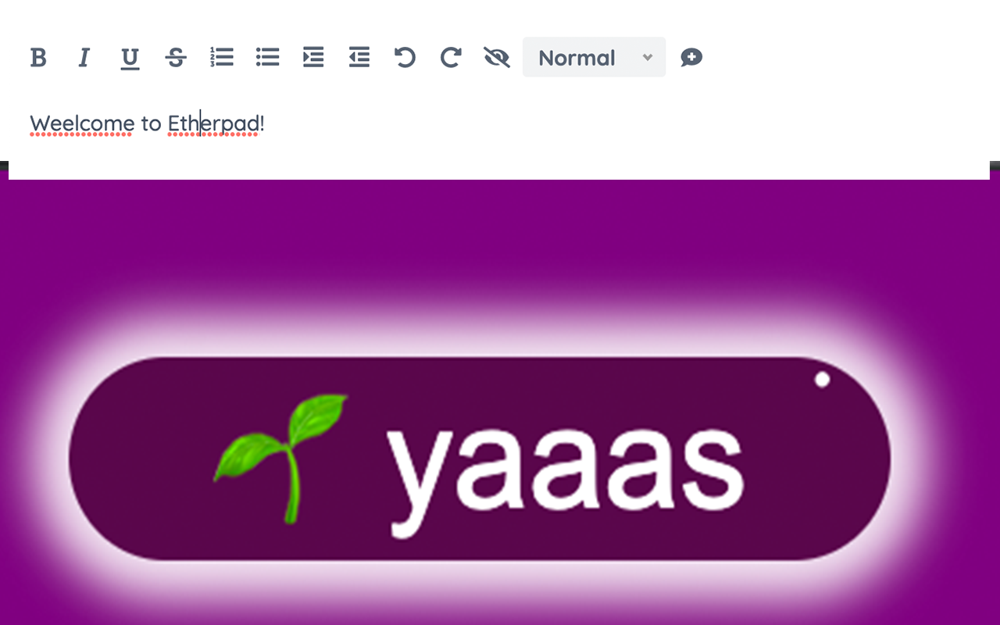

# 🌱 Ether-Spell 🌱

---

> activate spellchecking in Etherpad (as a browser extension)

---

> **Warning**
>
> Turning Spellchecking on can deteriorate your performance (especially on older computers and with more active participants.)

---

As a very dyslexic person that is highly dependent on spellcheckers, and considers them as assistive devices. I'm increasingly frustrated that Etherpad does not provide a spellcheck solution.  Again and again I found myself going for Google Docs instead of Etherpad or at least typing in another program with better spellcheck support.  Which totally goes against the collaborative aspect of Etherpad… This stops now! … at least for me. And maybe it is also useful for you :)

This plugin is still a work in progress, so if you find an Etherpad installation that does not function with this plugin, please reach out to me.

## Notes

- there is also an [official(?) plugin](https://github.com/ether/ep_spellcheck) that activates spellcheck in Etherpad, but then people come and use some obscure instance, and you're without spellchecking again…
- this plugin can also be used in combination with complex spellcheckers like [LanguageTool](https://languagetool.org/) or [Hunspell](https://hunspell.github.io/). But be aware that this can have a negative impact on performance.
- compatibible with:
  - firefox
  - opera
  - brave
  - vivaldi
  - google-chrome / chromium
  - edge
  - ~~safari~~ (apple charges 100€ per year) but if you need to use safari, I could create a bookmarklet for you, just reach out to me.
- for manual installations: [Automatic Releases](https://github.com/milangress/etherpad-spellchecker-web-extension/releases)

## Participate / Contribute

### 🛠 Build locally

1. Checkout the copied repository to your local machine eg. with `git clone https://github.com/milangress/etherpad-spellchecker-web-extension`
1. Run `npm install` to install all required dependencies
1. Run `npm run build`

The build step will create the `distribution` folder, this folder will contain the generated extension.

### 🏃 Run the extension

Using [web-ext](https://extensionworkshop.com/documentation/develop/getting-started-with-web-ext/) is recommended for automatic reloading and running in a dedicated browser instance. Alternatively you can load the extension manually (see below).

1. Run `npm run watch` to watch for file changes and build continuously
1. Run `npm install --global web-ext` (only only for the first time)
1. In another terminal, run `web-ext run -t chromium`

#### Manually

You can also [load the extension manually in Chrome](https://www.smashingmagazine.com/2017/04/browser-extension-edge-chrome-firefox-opera-brave-vivaldi/#google-chrome-opera-vivaldi) or [Firefox](https://www.smashingmagazine.com/2017/04/browser-extension-edge-chrome-firefox-opera-brave-vivaldi/#mozilla-firefox).
